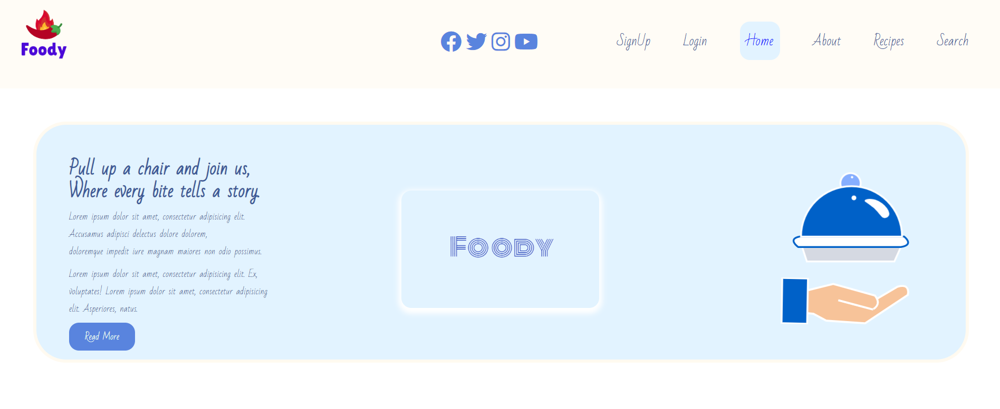
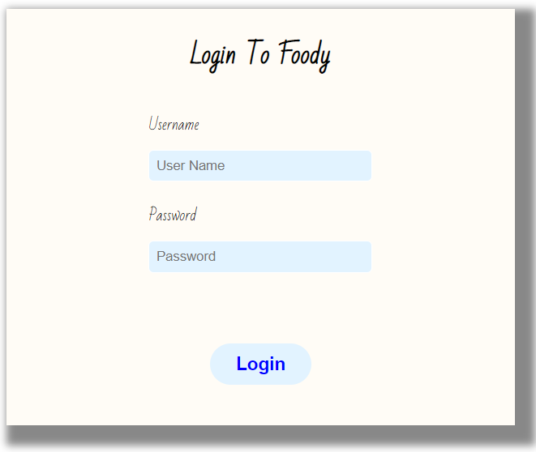
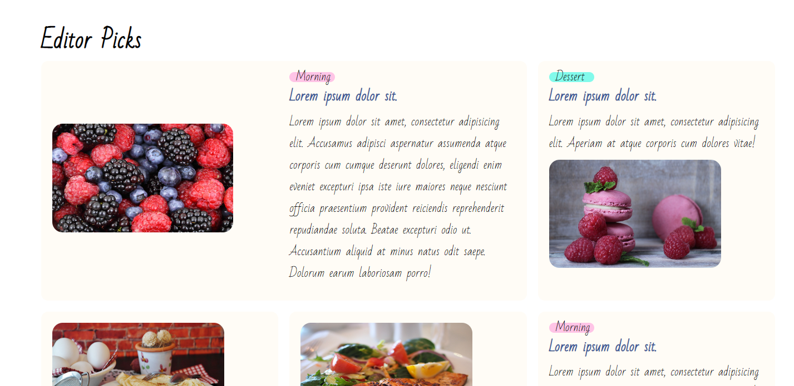
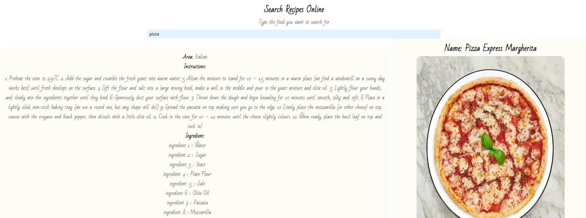
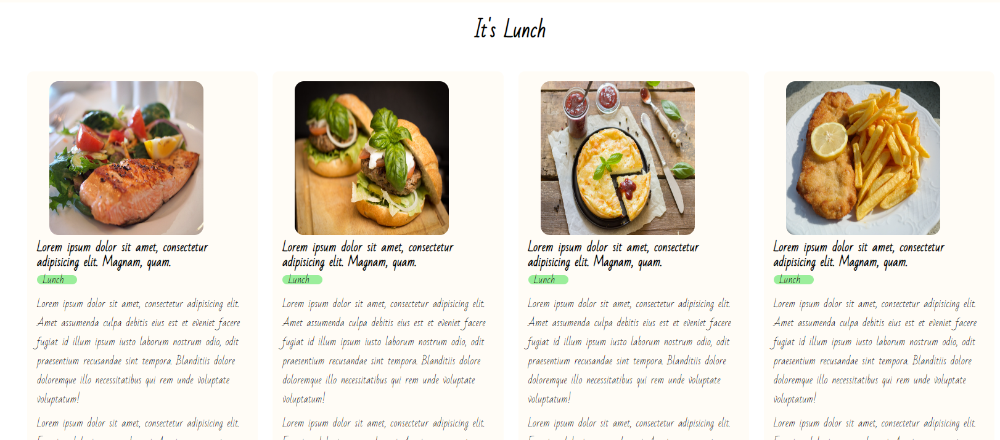
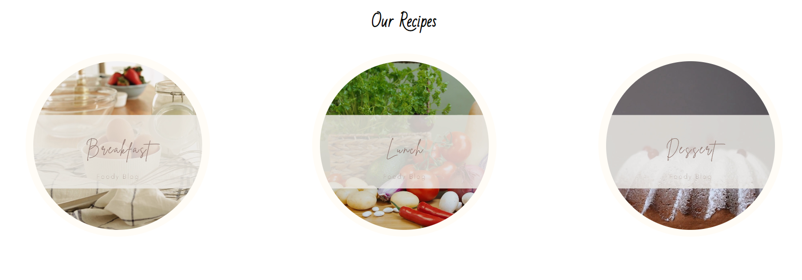
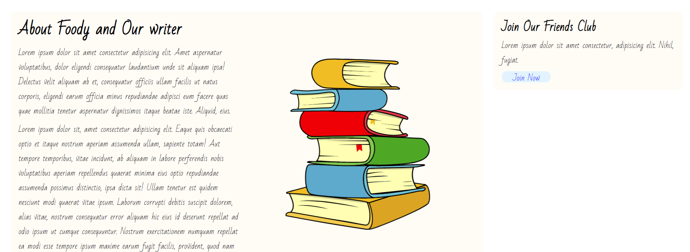
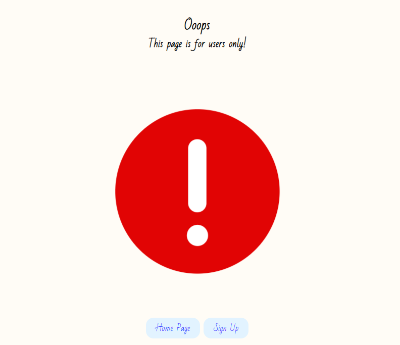
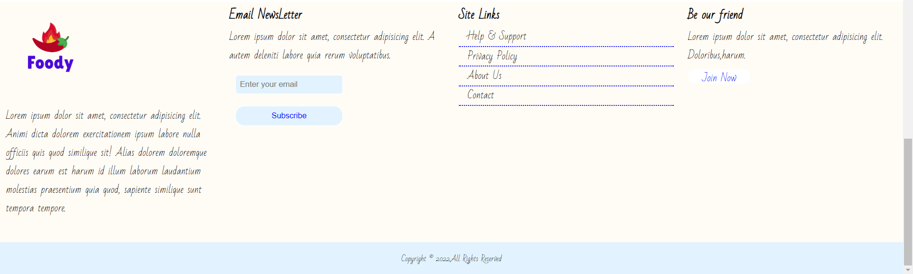

  <a href="https://github.com/carmelBar24/brain">
     

 
<i>A Responsive Food Blog Website using <a href="https://nodejs.org/en">Node js💕</a> & <a href="https://developer.mozilla.org/en-US/docs/Web/JavaScript"> JS🔥</a>&<a href="https://www.mysql.com/">My SQL🐬</a> </i>
  
  
## About the App 🌶️

  - Foody is a Food Blog where you can view recipes 🤤!
  
  - Login as guest or SignUp 🤩 and this will lead you to the feed page.
  
  - As a registered user you can see additional information that is not visible to guests😎.
  
  - All the data is stored in MySQL 🔥. Because of real-time database you'll get the latest summaries.
  
  - Future development: Sign in from Google/Facebook 🤗.
  
## Pages 😍

  

  

  
  
  
  

## In Action 👀

  

